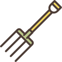

<h1>The Harvester Project</h1>

<h3> Description</h3>

With this project I want to give one's attention about the amount of information that people is sharing publicly on Internet.

The idea is have a lot of *Pitchforks* implementations, all of them taking into account the TOC of each site. Basically, a Pitchfork is the implementation of a social network crawler.

To obtain the information, we need a start point. This start point is called *Seed* and it can be any value into the common dictionary.

<h3> Seeds</h3>

- Email
- Company
- GithubUser
- TwitterUser
- PersonalSite
- Avatar
- Name
- Location
- Timezone
- Description
- Language
- KeybaseUser
- FacebookUser
- HackernewsUser
- RedditUser
- LinkedinUser
- BitcoinAddress

<h3> Pitchforks</h3>

- Web crawler
- Github
- Keybase
- Twitter

<h3> TODOs</h3>

- Seed weight implementation. Not all the results have the same importance or reliability.
- More Pitchforks (Facebook, Flickr, Quora, StackOverflow, Tumblr, etc.)

Icons made by <a href="http://www.freepik.com" title="Freepik">Freepik</a> from <a href="http://www.flaticon.com" title="Flaticon">www.flaticon.com</a> is licensed by <a href="http://creativecommons.org/licenses/by/3.0/" title="Creative Commons BY 3.0" target="_blank">CC 3.0 BY</a>

